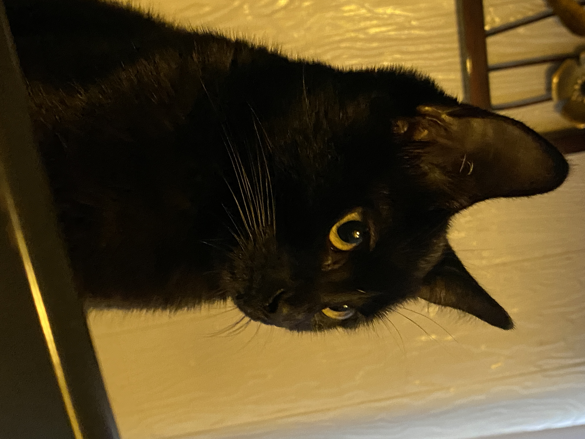

# My Day
## Morning 
1. Wake up and turn off 5 alarms!
2. Brush teeth
3. Wake up younger siblings (brother and sister)
4. Make some food like oatmeal
5. Get dressed
6. Feed cat Pt. 1
7. Drive siblings to school
---
## Morning to Afternoon
- Find a parking spot
- In classes (9:00 a.m to 1:00 p.m)
- Go home
---
## Afternoon
- Feed cat again Pt.2
- Find or make lunch
- Probably take a nap
- Do homework
- Feed cat again Pt. 3
---
## Night
1. Find a video to watch when I wash my face and brush my teeth
2. Brush teeth and wash face
3. Go to sleep!
---
### This is my cat her name is *Binky*! (she is a professional **ankle** biter)

